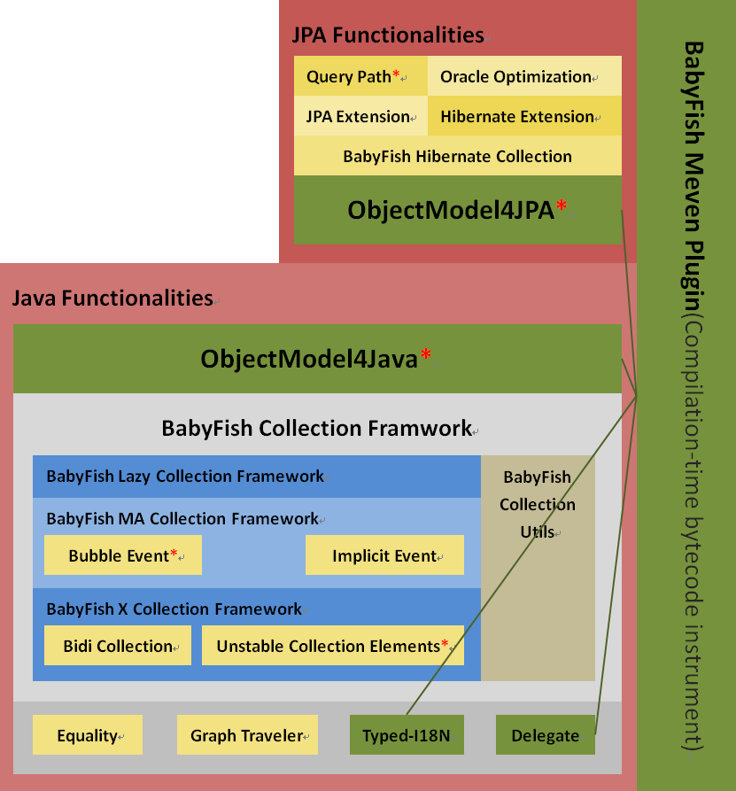

# 语言选择：<a href="README.md">英文</a> | 中文

# BabyFish是什么
BabyFish是一款让开发人员仅通过声明式代码的方式实现智能数据结构的Java框架；
其功能非常丰富，请阅读下面这张图片以对其大体架构有个粗略了解。

# 框架架构

    在这张图中，有5个功能点被红色星号标注：
    <ul>
        <li><a href="#unstableCollectionElements">Unstable Collection Elements</a></li>
        <li><a href="#bubbleEvent">Bubble Event</a></li>
        <li><a href="#objectModel4Java">ObjectModel4Java</a></li>
        <li><a href="#objectModel4JPA">ObjectModel4JPA</a></li>
        <li><a href="#queryPath">Query Path</a></li>
    </ul>
    ，它们是本框架最重要的5个功能点。

# Java环境要求
BabyFish1.1需要Java8

# 离线文档
<table>
    <thead>
        <tr>
            <th>文档</th>
            <th>描述</th>
        <tr>
    </thead>
    <tbody>
        <tr>
            <td><a href="tutorial.html">tutorial.html</a>（英文）</td>
            <td rowspan="2">图文并茂地详细讲述部分重要功能</td>
        </tr>
        <tr>
            <td><a href="tutorial.html">tutorial_zh_CN.html</a>（中文）</td>
        </tr>
        <tr>
            <td><a href="demo-guide.html">demo-guide.html</a>（英文）</td>
            <td rowspan="2">逐个介绍每个demo，并给出建议的阅读顺序。</td>
        </tr>
        <tr>
            <td><a id="demo-guide" name="demo-guide" href="demo-guide_zh_CN.html">demo-guide_zh_CN.html</a>（中文）</td>
        </tr>
    </tbody>
</table>

# 框架功能
<ul>
    <li>
        <h2> 1. Java部分</h2>
        <ul>
            <li>
                <h3>1.1. 基础功能</h3>
                <ul>
                    <li>
                        <h4>1.1.1. TypedI18N</h4>
                        提供一种更好的实现国际化的方法。和传统的使用在运行时刻报错的java.util.ResourceBundle进行开发不同，
                        请类型国际化的所有错误均在编译时刻报告给开发人员（此功能需要编译时字节码增强）。
                    </li>
                    <li>
                        <h4>1.1.2. Delegate</h4>
                        更好的事件通知模型, 如同.NET的委托一样，相比于Java Bean规范的建议更简单、更节约、更强大
                        （此功能需要编译时字节码增强）。
                    </li>
                    <li>
                        <h4>1.1.3. Equality</h4>
                        开发人员往往需要覆盖“public boolean equals(Object o)”方法，
                        通常他们有两种检查参数对象的类型是否和当前对象（this）的类型相同的办法。
                        <ul>
                            <li>过于严格的办法： if (this.getClass() != o.getClass()) return false; </li>
                            <li>过于宽松的办法：if (!(o instanceof ${ThisClass})) return false;</li>
                        </ul>
                        不幸的是，两种都是错的，本功能提供一种实现“equals”方法的完美方法，
                        其相应的demo指出它们各自的问题并给出正确的解决方案。
                    </li>
                    <li>
                        <h4>1.1.4. Graph Traveler</h4>
                        此功能用于深度优先或广度优先的对象图遍历,遍历过程中提供丰富的遍历上下文变量。
                    </li>
                </ul>
            </li>
            <li>
                <h3>1.2. BabyFish集合框架</h3>
                <ul>
                    <li>
                        <h4>1.2.1. X集合框架</h4>
                        

                            “X”代表“eXtensible”, 为了实现一些不可思议的功能，X集合框架扩展了Java集合框架的接口并给出一套全新的实现。
                        

                        

                            这里仅仅讨论X集合框架最重要的两个功能（请参考<a href="#demo-guide">demo-guide</a>以了解所有功能）。
                            <ul>
                                <li>
                                    <h5>1.2.1.1. Bidi集合</h5>
                                    和“org.apache.commons.collections4.BidiMap”类似, 为了让“java.util.Map”
                                    支持值（非键）的唯一性; X集合框架支持BidMap；同理，也支持BidiList。
                                </li>
                                <li>
                                    <h5>1.2.1.2. <a id="unstableCollectionElements" name="unstableCollectionElements">不稳定集合元素</a></h5>
                                    

                                        Java集合框架支持哈希结构和红黑树结构，例如HashMap, TreeSet and TreeMap；
                                        它们的好处是高性能，但是有一个缺陷，当某个对象被作为元素添加到Set或被作为键添加到Map，它的数据就不能被修改了。 
                                    

                                    

                                        X集合框架支持一个“不稳定集合元素的功能“，即便某个对象被作为元素添加到Set或被作为键添加到Map，
                                        它也可以被修改，因为与之相关的所有Set和Map集合均会在其被修改时自动修改。
                                        <table>
                                            <thead>
                                                <tr>
                                                    <th>集合类型</th>
                                                    <th>不稳定集合元素能力体现</th>
                                                </tr>
                                            </thead>
                                            <tbody>
                                                <tr>
                                                    <td>Set</td>
                                                    <td>不稳定元素</td>
                                                </tr>
                                                <tr>
                                                    <td>Map</td>
                                                    <td>不稳定键</td>
                                                </tr>
                                                <tr>
                                                    <td>BidiList</td>
                                                    <td>不稳定元素</td>
                                                </tr>
                                                <tr>
                                                    <td rowspan="2">BidiMap</td>
                                                    <td>不稳定键</td>
                                                </tr>
                                                <tr>
                                                    <td>不稳定值</td>
                                                </tr>
                                            </tbody>
                                        </table>
                                    

                                </li>
                            </ul>
                        

                    </li>
                    <li>
                        <h4>1.2.2. MA Collection Framework</h4>
                        

                            “MA”代表“Modification Aware”，MA集合框架扩展至X集合框架，用户支持数据变更事件通知。
                            对于每一个被修改的元素或键值对，两个事件将会被触发，其中一个在修改之前触发，而另外一个在修改后触发。
                            这个功能和关系型数据库的行级触发器极为类似。
                        

                        

                            这里仅仅讨论MA集合框架最重要的两个功能（请参考<a href="#demo-guide">demo-guide</a>以了解所有功能）。
                            <ul>
                                <li>
                                    <h5>1.2.2.1 Implicit Event</h5>
                                    在BabyFish集合框架中，集合对象的数据不仅会被显式的API调用修改，有时也会被系统自动修改。其中，最典型的代表就是“不稳定集合元素”导致的集合被自动修改的案例了。
                                    这种不是由开发人员发起的、自动的、隐式的集合修改照样会导致事件的触发。
                                </li>
                                <li>
                                    <h5>1.2.2.2 <a name="bubbleEvent">Bubble Event</a></h5>
                                    

                                        Java集合框架是支持集合视图的，例如
                                        <ul>
                                            <li>“java.util.NavigableMap”支持headMap、tailMap、subMap和descendingMap方法。</li>
                                            <li>“java.util.NavigableSet”支持headSet、tailSet、subSet、descendingSet和descendingIterator方法。</li>
                                            <li>“java.util.List”支持subList和listIterator方法。</li>
                                            <li>“java.util.Map”支持keySet、values和entrySet方法。</li>
                                            <li>“java.util.Collection”支持iterator方法。</li>
                                        </ul>
                                        这表示开发人员可以基于原始集合或视图集合创建新的视图集合，所有视图集合均和原始集合共享同一份数据，其中任何一个被修改时，原始集合均会受到影响。
                                    

                                    

                                        MA集合框架支持一个叫“冒泡事件“的功能，当视图集合被修改的时候，事件将会在此视图对象上被触发；然后，事件向上冒泡，让上一层视图集合触发事件；以此类推，最终，冒泡到根部的原始集合，事件将在原始集合上被触发。
                                    

                                </li>
                            </ul>
                        

                    </li>
                    <li>
                        <h4>1.2.3. Lazy Collection Framework</h4>
                        

                            我们知道，ORM框架常常支持一种叫延迟加载的技术，延迟集合被允许是虚假的，并不包含任何数据，直到第一次被开发人员使用时，才会通过IO操作从外界获取数据从而转变成真实集合。
                            这是一个很强大的功能，如此好的功能如果只能在ORM领域使用，就是太浪费了。
                        

                        

                            为了让这种强大的功能可以在任何场合被使用（而非仅仅在ORM实现中实现），BabyFish支持抽象而朴实的延迟集合框架。 
                        

                        

                            没有相应的demo，因为这是框架的SPI，并非API。
                        

                    </li>
                    <li>
                        <h4>1.2.4. Collection Utils</h4>
                        

                            Java集合框架附带了一个强大的工具类java.util.Collections， 此类提供很多静态方法以创建神奇的集合代理对象。
                        

                        

                            BabyFish集合框架扩展了Java集合框架的接口，类似的，它需要提供自己的工具类：org.babyfish.collection.MACollections"。
                        

                    </li>
                </ul>
            </li>
            <li>
                <h3><a name="objectModel4Java">1.3. ObjectModel4Java</h3>
                

                    ObjectModel为BabyFish框架的核心功能，也是我开发此框架的原因。
                

                

                    ObjectModel用于构建智能数据结构，又可分为两个部分
                    <ul>
                        <li>
                            ObjectModel4Java：在Java语言层面支持智能数据结构，这是本章节将重点介绍的功能。
                        </li>
                        <li>    
                            ObjectModel4JPA：在JPA层面支持智能数据结构，将在<a href="#objectModel4JPA">后续章节</a>中介绍。
                        </li>
                    </ul>
                

                

                    ObjectModel4Java具备很多功能，本文仅仅讨论两个：1、双向关联的一致性；2、不稳定对象
                    （请参考<a href="#demo-guide">demo-guide</a>以了解其所有功能）。
                

                <h4>1.3.1. 双向关联的一致性</h4>
                

                    Java开发人员往往将数据模型类声明成除了getter和setter访问器外没有任何逻辑的简单类
                    （说直白点，就是C语言结构体），这种简单的类所描述的数据结构的智能性和方便性非常有限。
                    举一简单的例子，对于两个对象之间的双向关联，开发人员其中一端时，另外一端没有对应地修改，
                    就会导致数据不一致，通过某个对象的关系能导航到另外一个对象，但反过来不成立。
                

                

                    ObjectModel4Java在为数据结构引入智能性的同时，并没有增加开发的复杂程度。毕竟，除了getter和setter访问器
                    之外无任何逻辑的数据类写起来是非常简单的，这种简单的代码书写方式早已深入人心。ObjectModel4Java
                    只需要开发人员在这些简单的数据类上添加一点注解，借助于编译时的字节码增强Maven插件，开发人员便可以得到功能强大的数据模型。
                

                

                    下面我们来看一个实际的例子，创建部门和员工之间的双向一对多关系。
                    <ul>
                        <li>
                            一个部门可以包含多个员工，且这些员工是有先后顺序的。
                            <pre><a href="src/babyfish-model/src/main/java/org/babyfish/model/Model.java">@Model</a> //该类使用ObjectModel4Java，需编译时字节码增强
public class <a id="department" name="department">Department</a> {
    
    <a href="src/babyfish-model/src/main/java/org/babyfish/model/Association.java">@Association</a>(opposite = <a href="#employee_department">"department"</a>) //该字段和“Employee.department”字段互为镜像，构成双向关联。
    private List&lt;<a href="#employee">Employee</a>&gt; <a id="department_employees" name="department_employees"> employees; //一个部门包含多个员工，该一对多集合字段有顺序，故采用List
    
    此处略去Getter和Setter
}</pre>
                        </li>
                        <li>
                            每个员工均属于某个部门，且它知道自己在其所属部门中的位置。
                            <pre><a href="src/babyfish-model/src/main/java/org/babyfish/model/Model.java">@Model</a> //该类使用ObjectModel4Java，需编译时字节码增强
public class <a id="employee" name="employee">Employee</a> {

    <a href="src/babyfish-model/src/main/java/org/babyfish/model/Association.java">@Association</a>(opposite = <a href="#department_employees">"employees</a>") //该字段和“Department.employees”字段互为镜像，构成双向关联。
    private <a href="#department">Department</a> <a id="employee_department" name="employee_department">department</a>; //员工属于一个部门，如果无，为null

    // 该字段依附于“Employee.department”字段，表示当前员工在department字段指向的父对象集合中的索引，
    // 如果department为null，此索引为-1
    <a href="src/babyfish-model/src/main/java/org/babyfish/model/Association.java">@IndexOf</a>(<a href="#employee_department">"department"</a>)
    private int index; 

    此处略去Getter和Setter
}</pre>
                        </li>
                    </ul>
                

                

                    假设现有6个对象，其变量名分别为department1, department2, employee1, employe2, employee3和employee4，它们的数据如下：
                

                <table>
                    <thead>
                        <tr>
                            <th colspan="2">部门对象</th>
                            <th colspan="3">员工对象</th>
                        </tr>
                        <tr>
                            <td>变量名</td>
                            <td>employees</td>
                            <td>变量名</td>
                            <td>department</td>
                            <td>index</td>
                        </tr>
                    </thead>
                    <tbody>
                        <tr>
                            <td rowspan="2">department1</td>
                            <td rowspan="2">[ employee1, employee2 ]</td>
                            <td>employee1</td>
                            <td>department1</td>
                            <td>0</td>
                        </tr>
                        <tr>
                            <td>employee2</td>
                            <td>department1</td>
                            <td>1</td>
                        </tr>
                        <tr>
                            <td rowspan="2">department2</td>
                            <td rowspan="2">[ employee3, employee4 ]</td>
                            <td>employee3</td>
                            <td>department2</td>
                            <td>0</td>
                        </tr>
                        <tr>
                            <td>employee4</td>
                            <td>department2</td>
                            <td>1</td>
                        </tr>
                    </tbody>
                </table>
                

                    此处，仅举一例，用户使用如下代码修改department1对象的employees集合
                    <pre>department1.getEmployees().add(0, employee3);</pre>
                    此语句视图将employee3插入到department1.employees集合的最前面，
                    为了维持数据结构一致性，ObjectModel4Java将会执行如下调整。
                

                <ul>
                    <li>自动将employee3从department2.employees集合中删除。</li>
                    <li>自动将employee3.department设置为department1。</li>
                    <li>自动将employee1的index从0变成1。</li>
                    <li>自动将employee2的index从1变成2。</li>
                    <li>自动将employee4的index从1变成0。</li>
                </ul>
                
最终，数据结构变成这样

                <table>
                    <thead>
                        <tr>
                            <th colspan="2">部门对象</th>
                            <th colspan="3">员工对象</th>
                        </tr>
                        <tr>
                            <td>变量名</td>
                            <td>employees</td>
                            <td>变量名</td>
                            <td>department</td>
                            <td>index</td>
                        </tr>
                    </thead>
                    <tbody>
                        <tr>
                            <td rowspan="3">department1</td>
                            <td rowspan="3">[ employee3, employee1, employee2 ]</td>
                            <td>employee1</td>
                            <td>department1</td>
                            <td>1</td>
                        </tr>
                        <tr>
                            <td>employee2</td>
                            <td>department1</td>
                            <td>2</td>
                        </tr>
                        <tr>
                            <td>employee3</td>
                            <td>department1</td>
                            <td>0</td>
                        </tr>
                        <tr>
                            <td>department2</td>
                            <td>[ employee4 ]</td>
                            <td>employee4</td>
                            <td>department2</td>
                            <td>0</td>
                        </tr>
                    </tbody>
                </table>
            </li>
            <li>
                <h4>1.3.2. 不稳定对象。</h4>
                

                    在上个例子中，关联字段使用了java.util.List集合，除此之外，集合关联属性还可以使用java.util.Set或java.util.Map。
                    接下来的例子中，我们使用java.util.Set来描述公司和投资人之间的双向多对多关系。
                

                <ul>
                    <li>
                        一个公司可以由多个投资人投资。
                        <pre><a href="src/babyfish-model/src/main/java/org/babyfish/model/Model.java">@Model</a> //该类使用ObjectModel4Java，需编译时字节码增强
public class <a id="company" name="company">Company</a> {
    
    <a href="src/babyfish-model/src/main/java/org/babyfish/model/Scalar.java">@Scalar</a> //标量字段，非关联。
    private String shortName;

    <a href="src/babyfish-model/src/main/java/org/babyfish/model/Association.java">@Association</a>(opposite = <a href="#investor_companies">"companies"</a>) //该字段和“Investor.companies”字段互为镜像，构成双向关联。
    // @ComparatorRule注解表示该Set集合使用Investor.name字段
    // 计算Investor对象的hashCode以及判断两个Investor对象是否相等。
    <a href="src/babyfish-model/src/main/java/org/babyfish/model/ComparatorRule.java">@ComparatorRule</a>(properties = <a href="src/babyfish-model/src/main/java/org/babyfish/model/ComparatorProperty.java">@ComparatorProperty</a>(<a href="#investor_name">"name"</a>))
    private Set&lt;<a href="#investor">Investor</a>&gt; <a id="company_investors" name="company_investors"> investors; 
    
    此处略去Getter和Setter
}</pre>
                    </li>
                    <li>
                        一个投资者也可以由多个投资人投资。
                        <pre><a href="src/babyfish-model/src/main/java/org/babyfish/model/Model.java">@Model</a> //该类使用ObjectModel4Java，需编译时字节码增强
public class <a id="investor" name="investor">Investor</a> {
    
    <a href="src/babyfish-model/src/main/java/org/babyfish/model/Scalar.java">@Scalar</a> //标量字段，非关联。
    private String <a id="investor_name" name="investor_name">name</a>;

    <a href="src/babyfish-model/src/main/java/org/babyfish/model/Association.java">@Association</a>(opposite = <a href="#company_investors">"investors"</a>) //该字段和“Company.investors”字段互为镜像，构成双向关联。
    private Set&lt;<a href="#company">Company</a>&gt; <a id="investor_companies" name="investor_companies"> companies; 
    
    此处略去Getter和Setter
}</pre>
                    </li>
                </ul>
                

                    假设现有3个对象，其中的一个Company类型的对象，变量名为apple，还有两个Investor对象，变量名为steve和sculley。
                    它们的数据如下：
                

                <table>
                    <thead>
                        <tr>
                            <th colspan="3">公司对象</th>
                            <th colspan="3">投资人对象</th>    
                        </tr>
                        <tr>
                            <th>变量名</th>
                            <th>shortName</th>
                            <th>investors</th>
                            <th>变量名</th>
                            <th>name</th>
                            <th>companies</th>
                        </tr>
                    </thead>
                    <tbody>
                        <tr>
                            <td rowspan="2">apple</td>
                            <td rowspan="2">Apple</td>
                            <td rowspan="2">[ steve, sculley ]</td>
                            <td>steve</td>
                            <td>Steve</td>
                            <td>[ apple ]</td>
                        </tr>
                        <tr>
                            <td>sculley</td>
                            <td>Sculley</td>
                            <td>[ apple ]</td>
                        </tr>
                    </tbody>
                </table>
                
现在开发人员执行如下一句代码：

                <pre>sculley.setName("Steve");</pre>
                

                    执行这句代码后，sculley对象的name字段的值就和steve对象的name字段的值一样了，均为Steve；
                    但是<a href="#company">Company</a>类的<a href="#company_investors">investors</a>字段
                    使用<a href="src/babyfish-model/src/main/java/org/babyfish/model/ComparatorRule.java">@ComparatorRule</a>
                    注解限定该集合不允许出现<a href="#investor_name">name</a>字段值相等的两个<a href="#investor">Investor</a>对象。
                    这是一个矛盾的局面。
                

                

                    幸运的是，<a href="#company">Company</a>类的<a href="#company_investors">investors</a>
                    字段支持<a href="#unstableCollectionElements">”不稳定集合元素“</a>；所以将会导致如下的效应。
                

                <ul>
                    <li>
                        为了保证Set集合的唯一性，在“不稳定集合元素”机制的作用下，steve对象将会从apple对象的
                        <a href="#company_investors">investors</a>集合字段中被自动排挤出去。
                    </li>
                    <li>
                        由于steve对象不再是apple对象的投资人，为了维护双向关联的一致性，apple对象也将会从steve对象的
                        <a href="#investor_companies">companies</a>集合中被自动删除。
                    </li>
                </ul>
                
最终，数据结构变成这样

                <table>
                    <thead>
                        <tr>
                            <th colspan="3">公司对象</th>
                            <th colspan="3">投资人对象</th>    
                        </tr>
                        <tr>
                            <th>变量名</th>
                            <th>shortName</th>
                            <th>investors</th>
                            <th>变量名</th>
                            <th>name</th>
                            <th>companies</th>
                        </tr>
                    </thead>
                    <tbody>
                        <tr>
                            <td>apple</td>
                            <td>Apple</td>
                            <td>[ sculley ]</td>
                            <td>steve</td>
                            <td>Steve</td>
                            <td>[]</td>
                        </tr>
                        <tr>
                            <td colspan="3"></td>
                            <td>sculley</td>
                            <td>Steve</td>
                            <td>[ apple ]</td>
                        </tr>
                    </tbody>
                </table>
            </li>
        </ul>
    </li>
    <li>
        <h2>2. JPA部分</h2>
        <ul>
            <li>
                <h3>2.1. <a id="objectModel4JPA" name="objectModel4JPA">ObjectModel4JPA</h3>
                

                    ObjectModel4JPA是<a href="#objectModel4Java">ObjectModel4Java</a>的扩展，
                    其功能和<a href="#objectModel4Java">ObjectModel4Java</a>一样，
                    但二者的目的不同，它允许在JPA实体类上使用ObjectModel，而非针对普通的Java类；
                    同样，二者的声明方式也有不同，更多的细节请参照<a href="#demo-guide">demo-guide</a>。
                

                

                   和<a href="#objectModel4Java">ObjectModel4Java</a>一样，
                   ObjectModel4JPA也需要基于Maven插件的编译时字节码增强。
                

            </li>
            <li>
                <h3>2.2. BabyFish Hibernate Collection Framework</h3>
                <ul>
                    <li>
                        在<a href="#objectModel4Java">ObjectModel4Java</a>中，
                        作为关联字段的集合支持双向关联一致性以及X集合框架和MA集合框架的所有功能。
                        ObjectModel4JPA既然功能与前者一样，其关联字段的集合当然也要具备这些功能。
                    </li>
                    <li>
                        由于<a href="#objectModel4JPA">ObjectModel4JPA</a>是为JPA/Hibernate设计的，
                        所以，关联字段的集合必须继承原生Hibernate集合的延迟加载能力。
                    </li>
                </ul>
                

                    为了让实体对象的集合字段能具备以上所有能力，BabyFish扩展Lazy集合框架，给出了
                    自己的Hibernate集合实现。
                

                

                    此功能并无相关demo，因为这是BabyFish Hibernate功能扩展内部模块的一部分。
                    作为开发人员，只需要知道<a href="#objectModel4JPA">ObjectModel4JPA</a>中的集合既有ObjectModel4Java中集合的功能
                    也有原生的Hibernate中集合的功能即可。
                

            </li>
            <li>
                <h3>2.3. JPA & Hibernate Extension</h3>
                

                    BabyFish对JPA和Hibernate API进行了扩展，提供了一些新功能，
                    本文仅讨论最重要的两个：QueryPath和Oracle Optimization
                    （请参考<a href="#demo-guide">demo-guide</a>以了解所有功能）。
                

                <ul>
                    <li>
                        <h4>2.3.1. <a name="queryPath">Query Path</a></h4>
                        

                            为了在查询业务支持支持动态的贪懒加载（关联对象的抓取方式由业务层和表示层的通过传递参数动态决定，而非在数据层内部硬编码实现）, 
                            BabyFish支持一个叫“Query Path”的功能，它看起来非常类似于
                            <ul>
                                <li><a href="http://api.rubyonrails.org/classes/ActiveRecord/QueryMethods.html#method-i-includes">Active Record的贪婪加载能力</a></li>
                                <li><a href="https://msdn.microsoft.com/en-us/library/bb738708(v=vs.110).aspx">ADO.NET Entity Framework的贪婪加载能力</a></li>
                            </ul>
                            此功能比从JPA2.1开始支持的
                            <a href="https://docs.oracle.com/javaee/7/api/javax/persistence/EntityGraph.html">
                                javax.persistence.EntityGraph
                            </a>
                            更简单，更优雅，更强大。请忘记后者并在实际项目中使用QueryPath。
                        

                        

                            和 
                            <a href="http://api.rubyonrails.org/classes/ActiveRecord/QueryMethods.html#method-i-includes">Active Record的的贪婪加载能力</a>
                            以及 
                            <a href="https://msdn.microsoft.com/en-us/library/bb738708(v=vs.110).aspx">ADO.NET Entity Framework的贪婪加载能力</a>
                            相比，QueryPath具备如下三个优势。
                        

                        <ul>
                            <li>
                                Active Record和ADO.NET Entity Framework的包含路径是类型不安全的字符串， 错误路径的错误要等到运行或测试程序才会被报告。
                                而Query Path则通过Maven插件在编译时生成Query Path元模型源码的方式让路径强类型化，错误的路径会在编译时报错。
                            </li>
                            <li>
                                QueryPath不仅仅可以以当前被查询对象为核心对任意深度和广度的的关联属性进行贪婪加载，还可以对延迟的标量属性（不一定但往往是大字段）进行贪婪加载。
                            </li>
                            <li>
                                QueryPath还可以对被查询对象本身以及对象之间的集合关联进行排序。
                            </li>
                        </ul>
                    </li>
                    <li>
                        <h4>2.3.2. Oracle Optimization</a></h4>
                        

                            Hibernate有一个性能缺陷。当某个查询既包含对集合关联的抓取（join fetch）又具备分页条件时，
                            Hibernate无法通过SQL语句实现分页查询，而是先不分页地查询出所有满足条件的对象，然后在内存中完成分页筛选，
                            同时在日志文件中打印如下警告：
                        

                        
"firstResult/maxResults specified with collection fetch; applying in memory!"

                        

                            针对Oracle数据库，BabyFish能解决此问题，只需要开发使用BabyFish扩展过的Oracle方言即可，如下：
                        

                        <ul>
                            <li><a href="./src/babyfish-hibernate-extension/src/main/java/org/babyfish/hibernate/dialect/Oracle8iDialect.java">org.babyfish.hibernate.dialect.Oracle8iDialect</a></li>
                            <li><a href="./src/babyfish-hibernate-extension/src/main/java/org/babyfish/hibernate/dialect/Oracle9iDialect.java">org.babyfish.hibernate.dialect.Oracle9iDialect</a></li>
                            <li><a href="./src/babyfish-hibernate-extension/src/main/java/org/babyfish/hibernate/dialect/Oracle10gDialect.java">org.babyfish.hibernate.dialect.Oracle10gDialect</a></li>
                        </ul>
                    </li>
                </ul>
            </li>
        </ul>
    </li>
</ul>

# 许可：LPGL3.0
BabyFish采用the LGPL-3.0授权，可以在商业应用中免费试用, 
请参考[http://opensource.org/licenses/LGPL-3.0](http://opensource.org/licenses/LGPL-3.0)以了解更多。

# 鸣谢
特别感谢两个伟大的框架：[ASM](http://asm.ow2.org)和[ANTLR](http://www.antlr.org)。

# 历史
>* 2008年8月： 我有了某些点子呢, 开始利用工作外的业务时间开发此框架。
>* 2015年10月： 完成第一个版本1.0.0并上传至github
>* 2016年6月： 完成1.1.0版本。

# 联系我，提出意见和期望
陈涛, [babyfish-ct@163.com](mailto:babyfish-ct@163.com)

2016年6月25日于成都。
